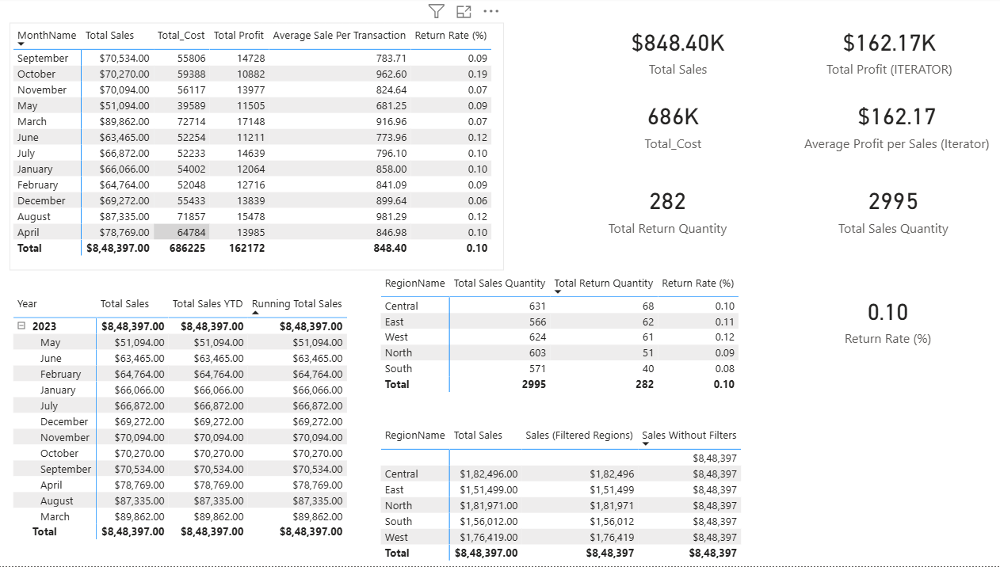

# 📊 DAX Depo – Advanced Power BI DAX Analytics Project

> **Backend Data Modeling & Advanced DAX Calculations (Matrix-Only Analysis)**

---

## 🚀 Project Overview

**DAX Depo** is an advanced Power BI backend analytics initiative requested by **senior leadership** to evaluate the strength, flexibility, and depth of **DAX (Data Analysis Expressions)** for generating business insights.

🔒 **Strict Constraint:**  
No visuals are used **except Matrix tables**, ensuring that **all KPIs, metrics, and time intelligence insights** are driven purely by DAX logic and filter context.

---

## 🎯 Project Goals

- Build a robust **Sales & Returns data model**
- Perform **advanced DAX calculations**
- Generate KPIs without charts or cards
- Demonstrate **filter context behavior**
- Implement **time intelligence** using Matrix only
- Maintain clean and scalable **measure management**

---

## 🧱 Dataset Tables Used

The project follows a **Star Schema** design.

| Table Name | Description |
|-----------|------------|
| `Sales_Fact` | Transaction-level sales data |
| `Returns_Fact` | Returned items data |
| `Customer_Dim` | Customer details & segments |
| `Product_Dim` | Product & category information |
| `Date_Dim` | Calendar table for time intelligence |
| `Region_Dim` | Regional and geographical data |

---

## 🧮 Calculated Columns

### 1️⃣ Profit Column
- **Formula:** `SalesAmount - Cost`
- Created in `Sales_Fact`

### 2️⃣ Return Flag
- Values:
  - **Returned**
  - **Not Returned**

### 3️⃣ Customer Full Name
- Combines **First Name + Last Name**
- Created in `Customer_Dim`

---

## 📐 DAX Measures Created

### 💰 Financial Measures
- **Total Sales**
- **Total Cost**
- **Total Profit**

### 🔁 Performance Measures
- **Return Rate (%)**
- **Average Sale per Transaction**

---

## ⚡ Quick Measures Used

- 📈 **Year-Over-Year Sales Growth**
- 📉 **Current vs Previous Month Sales Difference**

> Quick Measures were validated and optimized for enterprise usage.

---

## 🗂️ Measure Management

✔ A **Dedicated Measure Table** was created to:
- Improve model readability
- Centralize all DAX logic
- Support enterprise-scale maintenance

---

## 🎛️ Filter Context & Behavior

Matrix visuals were used to analyze **Sales by Region**:

- Without filters
- With filters applied
- Using:
  - `CALCULATE()`
  - `FILTER()`

This demonstrates how **DAX reacts to context changes**.

---

## 🧠 DAX Functions & Operators Used

### ➗ Mathematical & Statistical
- `SUM`, `AVERAGE`, `MAX`

### 🔢 Counting & Iterators
- `COUNTX`, `DISTINCTCOUNT`
- `SUMX`, `AVERAGEX`

### 🔀 Conditional Logic
- `IF`, `AND`, `OR`, `SWITCH`

### 🔤 Text Functions
- `CONCATENATE`
- `UPPER`
- `LEFT`

### 📅 Date Functions
- `YEAR`
- `MONTH`
- `EOMONTH`

---

## 🔗 Relationships & RELATED()

- Used `RELATED()` to fetch:
  - Product attributes
  - Customer details
  - Region information
- Ensured **proper one-to-many relationships**

---

## ⏱️ Time Intelligence (Matrix-Only)

Advanced time analysis using:

- `TOTALYTD()`
- `SAMEPERIODLASTYEAR()`
- `DATESINPERIOD()`
- `DATESBETWEEN()` for **Running Totals**

📌 All results displayed **only in Matrix visuals**.

---

## 🧩 Additional Business Scenarios

### 🟦 Sales Categorization
Sales classified into:
- **Low**
- **Medium**
- **High**

Implemented using `SWITCH()`.

### 📊 Aggregated Metrics
Iterator functions (`SUMX`, `AVERAGEX`) used for:
- Conditional calculations
- Weighted analysis

---

## 🖼️ Sample Output (Matrix View)

> Example representation of Matrix-based insights

---

## 🏆 Key Learnings

- Strong demonstration of **advanced DAX**
- Clear understanding of **filter & row context**
- Proven capability to build KPIs without visuals
- Enterprise-ready analytical approach

---

---

## 👤 Author

**Ayush Isamaliya**  
📊 Power BI | DAX | Data Analytics  
🚀 GitHub Portfolio Project

---

⭐ If you found this project helpful, consider starring the repository!

