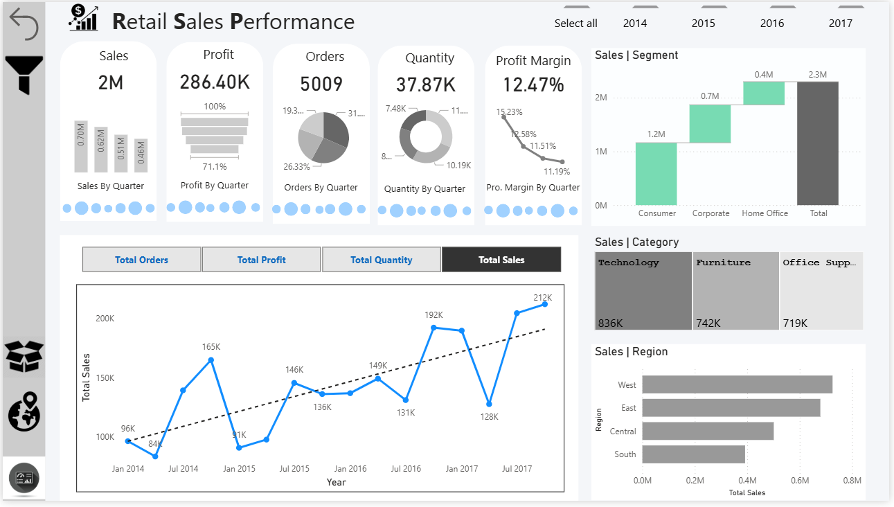
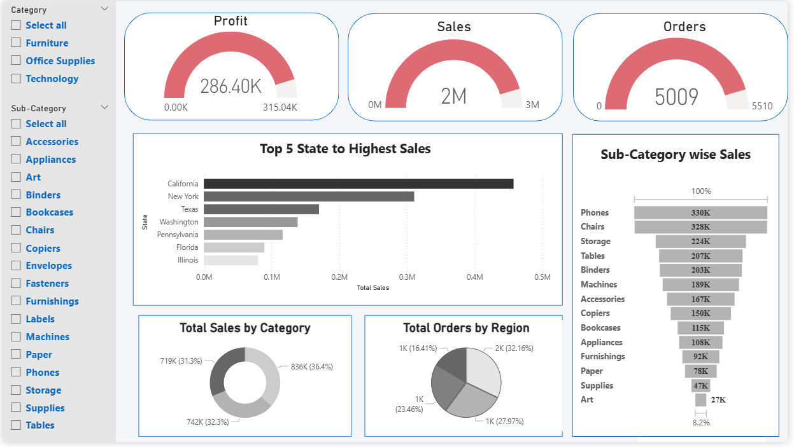

# 📊 Sales Performance Dashboard – Power BI
## 📷 Dashboard Preview

<p align="center">
  
</p>
<p align="center">
  
</p>


## 📌 Project Overview
This project presents a **Sales Performance Dashboard** developed using **Microsoft Power BI**.  
The dashboard provides deep insights into **Sales, Profit, Orders, Category, Sub-Category, Region, and State-wise performance** using interactive visuals and slicers.

The goal of this project is to help businesses and analysts:
- Track key performance indicators (KPIs)
- Identify top-performing states and products
- Analyze category-wise sales contribution
- Make data-driven business decisions

---

## ⚙️ Real-Time Business Usefulness

### ✔ Sales Monitoring
- Track **daily, monthly, and yearly sales performance** instantly
- Monitor overall revenue, profit, and order trends in real time
- Quickly identify performance fluctuations

---

### ✔ Strategic Decision Making
Helps business leaders identify:
- 📈 **Where sales are growing**
- 📦 **Which products need promotion**
- 🌍 **Which regions require attention or expansion**

Supports data-driven planning instead of guesswork.

---

### ✔ Inventory Optimization
- Prevent **overstocking** of low-demand products
- Avoid **understocking** of high-demand items
- Optimize inventory based on **sub-category sales insights**

---

### ✔ Performance Review
Useful for:
- Sales Managers
- Retail Analysts
- Business Owners

Enables performance comparison across **categories, regions, and states**.

---

## 🛠️ Tools & Technologies
- **Microsoft Power BI**
- **DAX (Data Analysis Expressions)**
- **CSV Data Source**
- **Data Modeling & Data Visualization**

---

---
## 📁 Repository Structure

```
Retail-Sales-Performance/
├── Superstore.csv
├── Retail Sales Performance.pbix
├── images/
│   ├── dashboard_overview.png
├── README.md
```

---

## 🧮 DAX Measures Used

These measures drive all KPI cards and charts:

```DAX
Total Sales = SUM(Sales[Sales])

Total Profit = SUM(Sales[Profit])

Total Orders = DISTINCTCOUNT(Sales[Order ID])

Total Quantity = SUM(Sales[Quantity])

Profit Margin % = DIVIDE([Total Profit], [Total Sales], 0)
```

### 🔹 Why Measures Are Used
- Measures respond to **filters & slicers**
- Ensure **dynamic and accurate calculations**
- Follow Power BI best practices

---

## 🧱 Calculated Columns Created

Calculated columns were added for **time-based analysis**:

```DAX
Year = YEAR(Sales[Order Date])

Quarter = "Q" & FORMAT(Sales[Order Date], "Q")

Month = FORMAT(Sales[Order Date], "MMM")

Year-Month = FORMAT(Sales[Order Date], "YYYY-MMM")
```

### 🔹 Purpose of Calculated Columns
- Enable **trend analysis**
- Support **quarter-wise and month-wise charts**
- Improve readability in visuals

---

## 📈 Visuals & Graph Descriptions

### 1️⃣ KPI Cards (Top Section)

**Visual Type:** Card / Gauge

**Shows:**
- Total Sales (2M)
- Total Profit (286.40K)
- Total Orders (5009)
- Total Quantity (37.87K)
- Profit Margin (12.47%)

📌 *Used for executive-level quick insights.*

---

### 2️⃣ Sales Trend Over Time

**Visual Type:** Line Chart

**Axis:**
- X-axis: Year / Month
- Y-axis: Total Sales

**Insight:**
- Identifies growth patterns
- Highlights seasonal fluctuations
- Shows long-term upward trend

---

### 3️⃣ Top 5 States by Sales

**Visual Type:** Horizontal Bar Chart

**Insight:**
- California and New York generate the highest sales
- Helps focus on high-revenue regions

---

### 4️⃣ Sales by Category

**Visual Type:** Donut Chart

**Insight:**
- Technology contributes the highest sales
- Balanced contribution from Furniture & Office Supplies

---

### 5️⃣ Sub-Category Wise Sales

**Visual Type:** Funnel Chart

**Insight:**
- Phones and Chairs are top-selling sub-categories
- Art and Supplies generate lower revenue

---

### 6️⃣ Sales by Region

**Visual Type:** Bar Chart

**Insight:**
- West region is the best performer
- South region needs improvement

---

### 7️⃣ Sales by Segment

**Visual Type:** Waterfall Chart

**Insight:**
- Consumer segment contributes most to total sales
- Corporate and Home Office add incremental value

---


## 🚀 How to Use
1. Download or clone the repository  
2. Open `Retail_Sales_Dashboard.pbix` using **Power BI Desktop**  
3. Refresh the data if required  
4. Use **slicers and interactive visuals** to explore insights dynamically  

---

## 📌 Key Business Insights Summary
- California is the **top revenue-generating state**
- Technology category contributes the **highest sales**
- Phones are the **most profitable sub-category**
- West and East regions record **higher order volumes**

---

## 🎯 Use Cases
- Retail Business Sales Analysis
- Power BI Portfolio Project
- Academic Mini / Major Project
- Interview Demonstration Dashboard

---

## 📜 License
This project is intended for **educational and portfolio purposes only**.

---

## 👨‍💻 Author
**Ayush Isamaliya**  
Power BI Developer | Data Analyst
