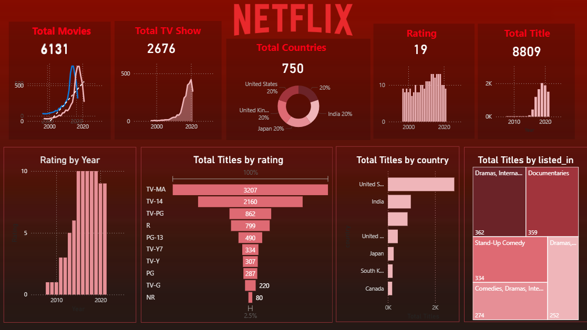

# 🎬 Netflix Data Analysis & Visualization Dashboard (Power BI)

A **professional end-to-end data analytics project** that explores, analyzes, and visualizes Netflix Movies & TV Shows data.  
The dashboard converts raw content metadata into **actionable insights**, **key performance indicators (KPIs)**, and **trend analysis** using modern Power BI design standards inspired by Netflix branding.

---

## 📌 Project Objective

The objective of this project is to:
- Understand Netflix’s **content growth strategy**
- Analyze **content distribution** across countries and years
- Identify **dominant ratings and categories**
- Present insights through an **interactive and visually engaging dashboard**

This project demonstrates **real-world data analysis, storytelling, and dashboard design skills**.

---

## 📷 Dashboard Preview

  

---

## 📊 Dataset Information

- **Dataset Name:** Netflix Movies & TV Shows
- **File Name:** `netflix.csv`
- **Format:** CSV
- **Data Type:** Structured
- **Content:** Movies & TV Shows metadata

### Key Columns Used:
| Column | Description |
|------|-------------|
| `show_id` | Unique identifier |
| `type` | Movie or TV Show |
| `title` | Content title |
| `director` | Director name |
| `cast` | Actors |
| `country` | Production country |
| `date_added` | Date added to Netflix |
| `release_year` | Release year |
| `rating` | Content rating |
| `listed_in` | Genre / Category |
| `duration` | Runtime or seasons |

---

## 📈 Key Performance Indicators (KPIs)

| KPI | Business Meaning |
|----|----------------|
| 🎥 Total Movies | Total movies available on Netflix |
| 📺 Total TV Shows | Total TV shows |
| 🌍 Total Countries | Content production reach |
| ⭐ Rating Categories | Diversity of audience targeting |
| 🎬 Total Titles | Overall content library size |

These KPIs provide a **high-level executive summary** of Netflix’s content portfolio.

---

## 🧠 Dashboard Features & Visualizations

### 🔴 1. Content Growth Over Time
- Line chart showing Movies & TV Shows growth by year
- Identifies Netflix’s rapid expansion phase after **2015**

📌 *Business Insight:*  
Supports strategic analysis of content investment trends.

---

### 🔴 2. Country-Wise Content Distribution
- Donut chart visualization
- Top contributing countries:
  - United States
  - India
  - United Kingdom
  - Japan

📌 *Business Insight:*  
Highlights Netflix’s global content acquisition strategy.

---

### 🔴 3. Rating Distribution Analysis
- Bar / donut chart
- Most dominant ratings:
  - **TV-MA**
  - **TV-14**
  - **TV-PG**

📌 *Business Insight:*  
Shows focus on mature and teen audiences.

---

### 🔴 4. Rating Trends by Year
- Year-wise breakdown of content ratings
- Noticeable growth in **TV-MA** content

📌 *Business Insight:*  
Indicates shift toward adult-oriented content over time.

---

### 🔴 5. Titles by Rating (Funnel Chart)
- Funnel chart ranking ratings by content volume
- Easy comparison of audience targeting levels

---

### 🔴 6. Titles by Country
- Horizontal bar chart
- Displays dominance of US-produced content

---

### 🔴 7. Titles by Category (Genre)
- Treemap visualization using `listed_in`
- Top genres:
  - Documentaries
  - Dramas
  - Stand-Up Comedy
  - International Movies

📌 *Business Insight:*  
Identifies high-demand genres for content planning.

---

## ⚙️ Dashboard Functionality

- Interactive filters (Year, Rating, Type)
- Dynamic cross-filtering across visuals
- Clean Netflix-themed color palette
- Optimized layout for storytelling
- User-friendly navigation

---

## 🛠 Tools & Technologies Used

- **Microsoft Power BI** – Data modeling & dashboard creation
- **DAX (Data Analysis Expressions)** – Measures & KPIs
- **CSV / Excel** – Data source
- **GitHub** – Version control & portfolio hosting

---

## 🚀 How to Use This Project

1. Clone or download the repository
2. Open **Power BI Desktop**
3. Load `netflix.csv`
4. Refresh the dataset
5. Interact with slicers and visuals to explore insights

---

## 📌 Key Insights Summary

- Netflix experienced **rapid content growth after 2015**
- **TV-MA** is the most dominant content rating
- The **United States** leads in content production
- Documentaries and dramas are top-performing genres
- Strong emphasis on global and mature audiences

---

## 🎯 Use Cases

- Data Analyst Portfolio Project
- Power BI Practice Dashboard
- Academic Mini / Major Project
- Interview Demonstration
- Media & Entertainment Analytics

---

## 📄 License
This project is intended for **educational and portfolio purposes only**.

---

## 👨‍💻 Author
**Ayush Isamaliya**  
Data Analyst | Power BI Developer  

⭐ If you find this project helpful, consider giving the repository a star!
