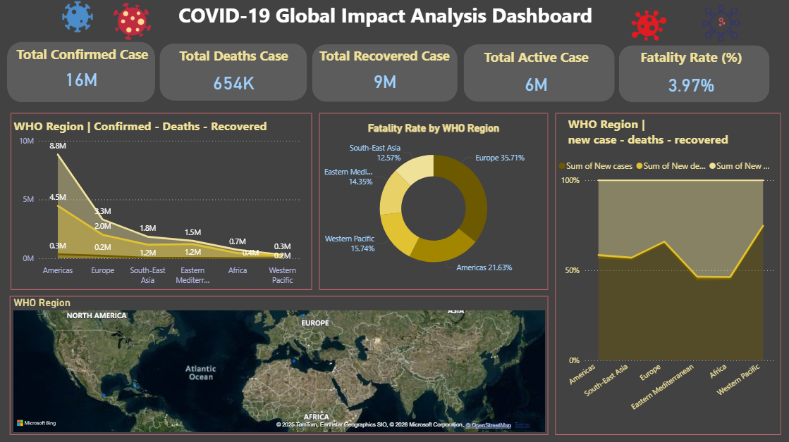

# 🦠 COVID-19 Global Impact Analysis Dashboard | Power BI

An **interactive Power BI dashboard** designed to analyze the **global impact of COVID-19** across **WHO regions**, focusing on **confirmed cases, deaths, recoveries, active cases, and fatality rate**.

This project converts raw pandemic data into **meaningful insights** to support **public health analysis, trend monitoring, and data-driven decision-making**.

---

## 📌 Project Overview

The **COVID-19 Global Impact Analysis Dashboard** provides a consolidated view of:
- Worldwide COVID-19 situation
- Regional comparison using WHO classifications
- Severity analysis through fatality rates
- Trends in new cases, deaths, and recoveries

The dashboard is designed with a **dark, modern theme** to enhance readability and professional presentation.

---

## 📷 Dashboard Preview

  

---

## 📊 Dataset Information

- **File Name:** `covid_19.csv`
- **Format:** CSV
- **Data Type:** Time-series & aggregated data
- **Source:** Public COVID-19 datasets (WHO / global reports)

### Key Columns Used:
| Column | Description |
|------|-------------|
| Country / Region | Country or WHO region |
| Confirmed Cases | Total confirmed cases |
| Deaths | Total deaths |
| Recovered | Total recovered cases |
| Active Cases | Currently active cases |
| New Cases | Newly reported cases |
| New Deaths | Newly reported deaths |
| Date | Report date |

---

## 📈 Key Performance Indicators (KPIs)

| KPI | Value |
|----|------|
| ✅ Total Confirmed Cases | **16M** |
| ❌ Total Deaths | **654K** |
| 💚 Total Recovered | **9M** |
| ⚠️ Total Active Cases | **6M** |
| 📉 Fatality Rate | **3.97%** |

📌 *Purpose:*  
These KPIs provide a **high-level snapshot of the global pandemic situation**.

---

## 🧠 Dashboard Visualizations Explained

### 🔴 1. WHO Region – Confirmed, Deaths & Recovered
- Area / line chart comparison by WHO region
- Regions analyzed:
  - Americas
  - Europe
  - South-East Asia
  - Eastern Mediterranean
  - Africa
  - Western Pacific

📌 **Insight:**  
Americas and Europe show the highest confirmed cases.

---

### 🔴 2. Fatality Rate by WHO Region
- Donut chart visualization
- Shows percentage contribution to global fatality rate

📌 **Insight:**  
Europe and Americas have comparatively higher fatality impact.

---

### 🔴 3. New Cases, Deaths & Recoveries by WHO Region
- Stacked area chart
- Compares new trends across regions

📌 **Insight:**  
Highlights regions with increasing or declining case trends.

---

### 🔴 4. WHO Region Map Visualization
- Interactive world map using Bing Maps
- Displays regional distribution geographically

📌 **Insight:**  
Helps visually understand **regional spread and concentration**.

---

## ⚙️ Dashboard Functionality & Features

- Interactive visuals with cross-filtering
- WHO region-based analysis
- Dark theme for better contrast and clarity
- KPI cards for instant understanding
- Geographical map integration
- Clean, professional layout

---

## 🛠 Tools & Technologies Used

- **Microsoft Power BI**
- **DAX (Data Analysis Expressions)**
- **CSV Dataset**
- **Data Modeling**
- **Geospatial Visualization (Bing Maps)**

---

## 🚀 How to Use This Project

1. Clone or download the repository  
2. Open `Covid_19 Dashboard.pbix` in **Power BI Desktop**  
3. Load or refresh `covid_19.csv` if required  
4. Explore insights using interactive visuals  

---

## 📌 Key Insights Summary

- Global confirmed cases exceed **16 million**
- Fatality rate remains under **4%**
- Americas and Europe are most impacted regions
- Recovery rates are improving globally
- Regional analysis helps identify high-risk zones

---

## 🎯 Use Cases

- Public Health Data Analysis
- Power BI Portfolio Project
- Academic Mini / Major Project
- Interview Demonstration Dashboard
- Data Visualization Practice

---

## 📄 License

This project is intended for **educational and portfolio purposes only**.  
Not intended for medical or clinical decision-making.

---

## 👨‍💻 Author

**Ayush Isamaliya**  
Power BI Developer | Data Analyst  

⭐ If you found this project useful, please star the repository!
