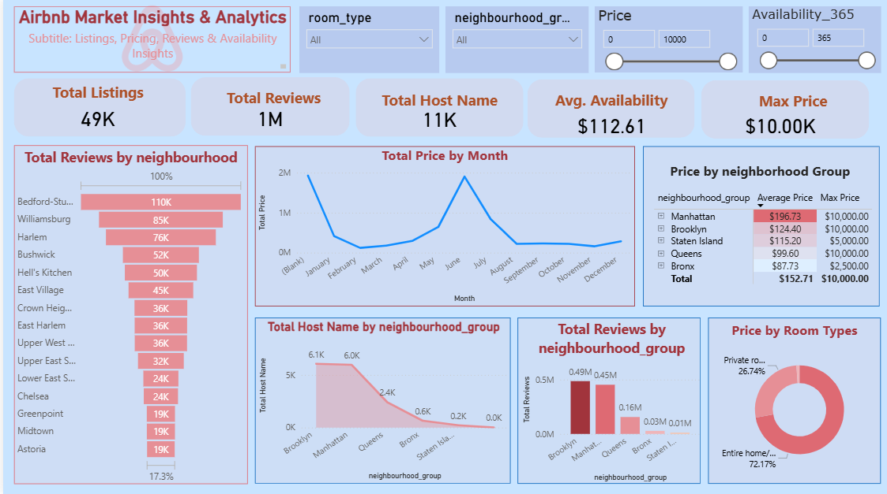

# 🏠 Airbnb Listings Market Insights & Analytics Dashboard | Power BI

An **interactive Power BI dashboard** designed to analyze Airbnb listings data and uncover **pricing trends, host behavior, review patterns, and availability insights** across neighborhoods and room types.

This project transforms raw Airbnb listing data into **actionable market intelligence** for hosts, analysts, and business decision-makers.

---

## 📌 Project Overview

The **Airbnb Listings Market Insights Dashboard** provides a comprehensive view of:
- Listing distribution and host activity
- Pricing behavior across neighborhoods
- Review trends and customer engagement
- Availability patterns throughout the year
- Room type performance and revenue potential

The dashboard is designed with a **clean, modern UI** for easy exploration and storytelling.

---

## 📷 Dashboard Preview

  

---

## 📊 Dataset Information

- **File Name:** `airbnb_listings.csv`
- **Format:** CSV
- **Domain:** Short-Term Rental / Hospitality Analytics
- **Geography:** City-level Airbnb data (e.g., NYC)

### Key Columns Used:
| Column | Description |
|------|-------------|
| id | Unique listing ID |
| name | Listing name |
| host_id | Host identifier |
| host_name | Host name |
| neighbourhood_group | Major area (Manhattan, Brooklyn, etc.) |
| neighbourhood | Local neighborhood |
| room_type | Entire home, Private room, Shared room |
| price | Nightly price |
| number_of_reviews | Total reviews |
| availability_365 | Days available per year |
| last_review | Most recent review date |

---

## 📈 Key Performance Indicators (KPIs)

| KPI | Value |
|----|------|
| 🏘 Total Listings | **49K** |
| ⭐ Total Reviews | **1M** |
| 👤 Total Hosts | **11K** |
| 📅 Avg. Availability | **112.61 days** |
| 💰 Max Price | **$10,000** |

📌 *Purpose:*  
These KPIs provide a **high-level snapshot of the Airbnb market size, engagement, and pricing range**.

---

## 🧠 Dashboard Visualizations Explained

### 🔴 1. Total Reviews by Neighborhood
- Funnel / ranked bar chart
- Highlights most reviewed neighborhoods:
  - Bedford-Stuyvesant
  - Williamsburg
  - Harlem
  - Bushwick

📌 **Insight:**  
High review counts indicate **popular and high-demand locations**.

---

### 🔴 2. Total Price by Month
- Line chart showing monthly price trends

📌 **Insight:**  
Reveals **seasonality in Airbnb pricing**, helping hosts optimize rates during peak demand periods.

---

### 🔴 3. Price by Neighborhood Group
- Table with **Average Price vs Max Price**
- Neighborhood groups:
  - Manhattan
  - Brooklyn
  - Queens
  - Bronx
  - Staten Island

📌 **Insight:**  
Manhattan commands the **highest average prices**, reflecting premium demand.

---

### 🔴 4. Total Hosts by Neighborhood Group
- Area / line chart
- Shows host concentration across regions

📌 **Insight:**  
Brooklyn and Manhattan have the **highest host density**, indicating competitive markets.

---

### 🔴 5. Total Reviews by Neighborhood Group
- Column chart
- Measures customer engagement by region

📌 **Insight:**  
Higher reviews signal **strong booking activity and guest satisfaction**.

---

### 🔴 6. Price by Room Type
- Donut chart
- Room types:
  - Entire Home / Apartment
  - Private Room

📌 **Insight:**  
Entire homes dominate pricing share, reflecting higher revenue potential.

---

## ⚙️ Interactive Features & Functionality

- Dynamic slicers:
  - Room Type
  - Neighborhood Group
  - Price Range
  - Availability (365 days)
- Cross-filtering across all visuals
- Clean color palette for clarity
- Optimized layout for business storytelling

---

## 🏡 Extra Airbnb Market Insights (Value-Added)

### 💡 Pricing Strategy
- Entire homes command significantly higher prices
- Premium neighborhoods justify higher nightly rates
- Price seasonality helps maximize revenue

### 💡 Host Behavior
- High host concentration = competitive pricing pressure
- Fewer hosts + high demand = premium pricing opportunity

### 💡 Review Analytics
- Reviews act as a proxy for booking volume
- High-review neighborhoods are safer investment zones

### 💡 Availability Optimization
- Lower availability often signals higher occupancy
- Hosts can balance availability to maximize earnings

---

## 🛠 Tools & Technologies Used

- **Microsoft Power BI**
- **DAX (Data Analysis Expressions)**
- **CSV Dataset**
- **Data Modeling & Visualization**
- **Interactive Slicers & Filters**

---

## 🚀 How to Use This Project

1. Clone or download the repository  
2. Open the `.pbix` file in **Power BI Desktop**  
3. Load or refresh the Airbnb CSV dataset  
4. Use slicers to explore pricing, availability, and reviews  

---

## 📌 Key Insights Summary

- Manhattan has the highest average listing price
- Brooklyn leads in total hosts and reviews
- Entire homes generate the majority of pricing share
- Certain neighborhoods consistently attract high engagement
- Pricing varies strongly by season and location

---

## 🎯 Use Cases

- Airbnb Host Pricing Optimization
- Short-Term Rental Market Analysis
- Power BI Portfolio Project
- Academic Mini / Major Project
- Interview Demonstration Dashboard
- Hospitality & Tourism Analytics

---

## 📄 License

This project is intended for **educational and portfolio purposes only**.  
Not affiliated with or endorsed by Airbnb.

---

## 👨‍💻 Author

**Ayush Isamaliya**  
Power BI Developer | Data Analyst  

⭐ If you found this project helpful, please star the repository!
